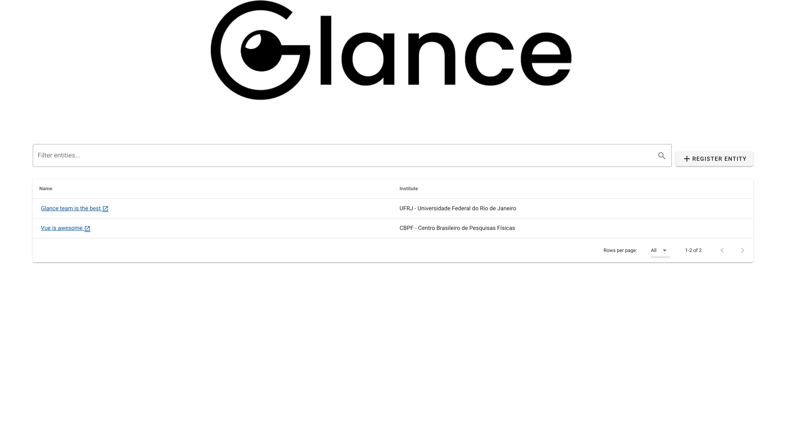

# Glance Architecture Proposal

This is a mock-up of the architecture proposal defined on [RFC 009](https://readthedocs.web.cern.ch/display/FPS/RFC+009+-+Top+level+architecture+proposal),
[RFC 010](https://readthedocs.web.cern.ch/display/FPS/RFC+010+-+Back-end+architecture+proposal)
and [RFC 011](https://readthedocs.web.cern.ch/display/FPS/RFC+011+-+Front-end+architecture+proposal).




## Back-end (api folder)
The back-end is missing the implementation of the SQL repositories and they are left as an exercise to the reader (jk lol).

## Front-end (client folder)
The front-end is fully functional. However, no API serves the endpoints, so it's kinda useless. For testing these are the API responses that the system should get:

GET /entities
```json
{ "entities":
  [
    {
      "id": 1,
      "name": "Glance team is the best",
      "institute": {
        "id": 1,
        "name": "UFRJ - Universidade Federal do Rio de Janeiro"
      }
    },
        {
          "id": 2,
          "name": "Vue is awesome",
          "institute": {
            "id": 2,
            "name": "CBPF - Centro Brasileiro de Pesquisas Físicas"
          }
        }
  ]
}
```
GET /entities/:id
```json
{
  "entity": {
    "id": 1,
    "name": "Glance team is the best",
    "institute": {
      "id": 1,
      "name": "UFRJ - Universidade Federal do Rio de Janeiro"
    }
  }
}
```
There are plenty API mock-ups (like [this](https://tweak-extension.com/) chrome extension) that should make the page look responsive enough.

